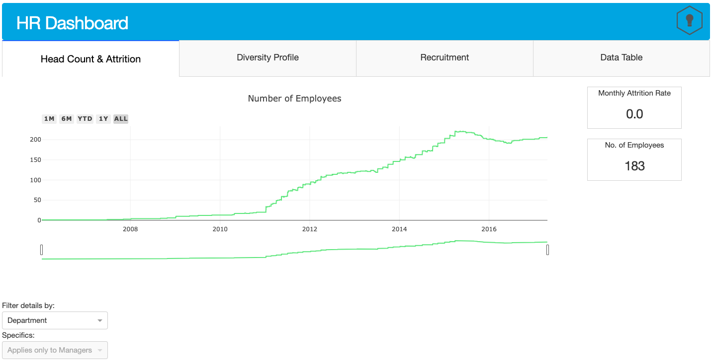

# Human Resource Dashboard using Plotly Dash



<hr>

### Intro

This is a mock dashboard created using Plotly and Dash. The dataset used is collected from [Kaggle](https://www.kaggle.com/rhuebner/human-resources-data-set). I used one of the files in this dataset to create a dashboard that showed information about recruiting sources, active employees, attrition rates, and many more. With Plotly and Dash, I experimented with chained callbacks to allow for more variety of dashboard filter options.

### How to run

This project has not been deployed yet, so it can only be run locally.

First, create a virtual environment with conda by entering the following in the terminal:
```
conda create --name hr_dash python=3.7
conda activate hr_dash
```
Then install the necessary packages:
```
python3 -m pip install -r requirements.txt
```

To serve the app locally:
```
python3 app.py
```

The web app will be launched to your localhost on port 8050: [http://127.0.0.1:8050]
